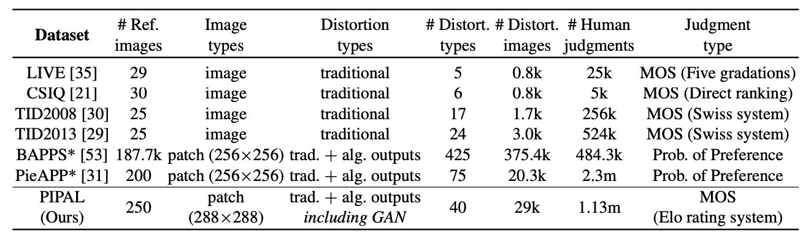

# PIPAL: Perceptual IQA Dataset and Codebase

## PIPAL: a Large-Scale Image Quality Assessment Dataset for Perceptual Image Restoration
<a href="https://www.jasongt.com" target="_blank">Jinjin Gu</a>, 
<a href="http://www.haomingcai.com" target="_blank">Haoming Cai</a>, 
<a>Haoyu Chen</a>, 
<a>Xiaoxing ye</a>, 
<a href="http://www.jimmyren.com" target="_blank">Jimmy S.Ren</a>, 
<a href="http://xpixel.group/2010/01/20/chaodong.html" target="_blank">Chao Dong</a>. In ECCV, 2020.

## 🧭  Navigation
- [ECCV 2020 Paper]() | [Project Web]() | [NTIRE 2021 Challenge](https://competitions.codalab.org/competitions/28050).
- Any questions, please contact with haomingcai@link.cuhk.edu.cn

<p align="center">

</p>

## 🔥 Important Notes [ 2021-01-25 ] 
- We are organizing <font color='orange'>NTIRE 2021 Perceptual IQA Challenge !! </font>. Find more in [NTIRE 2021 Challenge](https://competitions.codalab.org/competitions/28050).
- For now, our codebase <font color='red'> ONLY </font> support users to <font color='red'>train LPIPS on PIPAL or BAPPS</font> for now.
- <font color='orange'>The SWD module will be added in the future</font>.

## 🔧 Dependencies and Installation
- Python 3 (Recommend to use [Anaconda](https://www.anaconda.com/download/#linux))
- [PyTorch >= 1.0](https://pytorch.org/)
- NVIDIA GPU + [CUDA](https://developer.nvidia.com/cuda-downloads)
- Python packages: `pip install numpy opencv-python lmdb pyyaml`
- TensorBoard:
  - PyTorch >= 1.1: `pip install tb-nightly future`
  - PyTorch == 1.0: `pip install tensorboardX`


## 💻 How to Train
- **Your IQA**
	1. Prepare IQA dataset PIPAL public training [NTIRE 2021] or BAPPS. More details are in [`codes/data`](codes/data/README).
    1. Modify the dataset format based on your need in [`codes/data/PairedTrain_dataset.py`](codes/data/PairedTrain_dataset.py) and [`ValidorTest_dataset.py`](ValidorTest_dataset.py)
	1. Modify the configuration file [`codes/options/train_test_yml/train_our_IQA.yml`](codes/options/train_test_yml/train_our_IQA.yml)
	1. Run command:
	```c++
	python train.py -opt options/train_test_yml/train_IQA.yml
	```


## 📈 How to Test
- **Prepare the test dataset**
	1. Prepare IQA dataset PIPAL public validation [NTIRE 2021]. More details are in [`codes/data`](codes/data/README).
	1. Modify the dataset format based on your need in [`ValidorTest_dataset.py`](ValidorTest_dataset.py)
	1. Modify the configuration file [`codes/options/train_test_yml/test_IQA.yml`](codes/options/train_test_yml/test_IQA.yml)
	1. Run command:
	```c++
	python test.py -opt options/train_test_yml/test_IQA.yml
	```

## Ackowledgement
- This code is based on [mmsr](https://github.com/open-mmlab/mmsr).